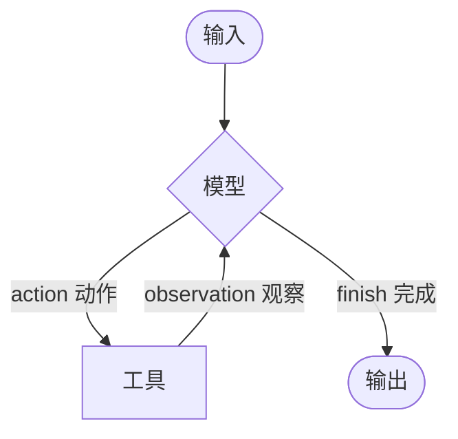

# LangChain Agents（智能代理）

> 来源：https://docs.langchain.com/oss/python/langchain/agents

---

## 概述

Agent 将语言模型与工具结合，创建能够**推理任务、决定使用哪些工具、迭代地朝目标推进**的系统。

`create_agent` 提供了一个生产就绪的 Agent 实现。



Agent 持续运行直到满足停止条件——模型输出最终结果或达到迭代限制。

---

## 核心组件

### 1. Model（模型）

模型的指定方式支持**静态**和**动态**两种。

#### 静态模型

创建 Agent 时配置一次，执行期间不变：

```python
# 方式一：从模型标识符字符串初始化
from langchain.agents import create_agent

agent = create_agent("openai:gpt-5.4", tools=tools)
```

> 💡 模型标识符支持自动推断，如 `"gpt-5.4"` 会被推断为 `"openai:gpt-5.4"`。

```python
# 方式二：直接初始化模型实例（更精细的控制）
from langchain.agents import create_agent
from langchain_openai import ChatOpenAI

model = ChatOpenAI(
    model="gpt-5.4",
    temperature=0.1,
    max_tokens=1000,
    timeout=30,
)
agent = create_agent(model, tools=tools)
```

#### 动态模型

根据运行时状态和上下文选择模型，支持复杂路由和成本优化：

```python
from langchain_openai import ChatOpenAI
from langchain.agents import create_agent
from langchain.agents.middleware import wrap_model_call, ModelRequest, ModelResponse

basic_model = ChatOpenAI(model="gpt-5.4-mini")
advanced_model = ChatOpenAI(model="gpt-5.4")

@wrap_model_call
def dynamic_model_selection(request: ModelRequest, handler) -> ModelResponse:
    """根据对话复杂度选择模型"""
    message_count = len(request.state["messages"])

    if message_count > 10:
        model = advanced_model  # 长对话用高级模型
    else:
        model = basic_model     # 短对话用基础模型

    return handler(request.override(model=model))

agent = create_agent(
    model=basic_model,
    tools=tools,
    middleware=[dynamic_model_selection],
)
```

> 🐞 预绑定的模型（已调用 `bind_tools`）不支持结构化输出。如需动态模型选择 + 结构化输出，确保传给中间件的模型未预绑定。

---

### 2. Tools（工具）

工具赋予 Agent 行动能力。Agent 不仅能绑定工具，还支持：

- 顺序调用多个工具（由单个提示触发）
- 适当时并行调用工具
- 基于前序结果动态选择工具
- 工具重试和错误处理
- 跨工具调用的状态持久化

#### 静态工具

```python
from langchain.tools import tool
from langchain.agents import create_agent

@tool
def search(query: str) -> str:
    """Search for information."""
    return f"Results for: {query}"

@tool
def get_weather(location: str) -> str:
    """Get weather information for a location."""
    return f"Weather in {location}: Sunny, 72°F"

agent = create_agent(model, tools=[search, get_weather])
```

> 空工具列表 = Agent 仅包含 LLM 节点，无工具调用能力。

#### 动态工具 — 过滤预注册工具

当所有可能的工具在创建时已知，可按状态/权限/上下文过滤：

**按 State（状态）过滤：**

```python
from langchain.agents.middleware import wrap_model_call, ModelRequest, ModelResponse

@wrap_model_call
def state_based_tools(request: ModelRequest, handler):
    state = request.state
    is_authenticated = state.get("authenticated", False)

    if not is_authenticated:
        tools = [t for t in request.tools if t.name.startswith("public_")]
        request = request.override(tools=tools)

    return handler(request)
```

**按 Store（长期存储）过滤：**

```python
@wrap_model_call
def store_based_tools(request: ModelRequest, handler):
    user_id = request.runtime.context.user_id
    store = request.runtime.store
    feature_flags = store.get(("features",), user_id)

    if feature_flags:
        enabled_features = feature_flags.value.get("enabled_tools", [])
        tools = [t for t in request.tools if t.name in enabled_features]
        request = request.override(tools=tools)

    return handler(request)
```

**按 Context（运行时上下文）过滤：**

```python
@wrap_model_call
def context_based_tools(request: ModelRequest, handler):
    user_role = request.runtime.context.user_role if request.runtime else "viewer"

    if user_role == "admin":
        pass  # 管理员获得所有工具
    elif user_role == "editor":
        tools = [t for t in request.tools if t.name != "delete_data"]
        request = request.override(tools=tools)
    else:
        tools = [t for t in request.tools if t.name.startswith("read_")]
        request = request.override(tools=tools)

    return handler(request)
```

#### 动态工具 — 运行时注册

工具在运行时发现/创建（如从 MCP 服务器加载），需要两个中间件钩子：

```python
from langchain.tools import tool
from langchain.agents.middleware import AgentMiddleware, ModelRequest, ToolCallRequest

@tool
def calculate_tip(bill_amount: float, tip_percentage: float = 20.0) -> str:
    """Calculate the tip amount for a bill."""
    tip = bill_amount * (tip_percentage / 100)
    return f"Tip: ${tip:.2f}, Total: ${bill_amount + tip:.2f}"

class DynamicToolMiddleware(AgentMiddleware):
    def wrap_model_call(self, request: ModelRequest, handler):
        updated = request.override(tools=[*request.tools, calculate_tip])
        return handler(updated)

    def wrap_tool_call(self, request: ToolCallRequest, handler):
        if request.tool_call["name"] == "calculate_tip":
            return handler(request.override(tool=calculate_tip))
        return handler(request)

agent = create_agent(
    model="gpt-4o",
    tools=[get_weather],
    middleware=[DynamicToolMiddleware()],
)
```

> 🐞 `wrap_tool_call` 钩子对于运行时注册的工具是**必需的**，否则 Agent 不知道如何执行动态添加的工具。

#### 工具错误处理

```python
from langchain.agents.middleware import wrap_tool_call
from langchain.messages import ToolMessage

@wrap_tool_call
def handle_tool_errors(request, handler):
    try:
        return handler(request)
    except Exception as e:
        return ToolMessage(
            content=f"Tool error: Please check your input and try again. ({str(e)})",
            tool_call_id=request.tool_call["id"],
        )
```

---

### 3. System Prompt（系统提示词）

```python
# 字符串形式
agent = create_agent(model, tools, system_prompt="You are a helpful assistant.")

# SystemMessage 对象（更精细控制，如 Anthropic 提示缓存）
from langchain.messages import SystemMessage

literary_agent = create_agent(
    model="google_genai:gemini-3.1-pro-preview",
    system_prompt=SystemMessage(content=[
        {"type": "text", "text": "You are an AI assistant tasked with analyzing literary works."},
        {"type": "text", "text": "<the entire contents of 'Pride and Prejudice'>",
         "cache_control": {"type": "ephemeral"}}
    ])
)
```

#### 动态系统提示词

```python
from langchain.agents.middleware import dynamic_prompt, ModelRequest

@dynamic_prompt
def user_role_prompt(request: ModelRequest) -> str:
    user_role = request.runtime.context.get("user_role", "user")
    base_prompt = "You are a helpful assistant."

    if user_role == "expert":
        return f"{base_prompt} Provide detailed technical responses."
    elif user_role == "beginner":
        return f"{base_prompt} Explain concepts simply and avoid jargon."

    return base_prompt
```

### 4. Name（名称）

设置可选的 Agent 名称，在多 Agent 系统中用作子图节点标识符：

```python
agent = create_agent(model, tools, name="research_assistant")
```

> 💡 推荐 `snake_case` 命名（如 `research_assistant`），某些提供商会拒绝含空格或特殊字符的名称。

---

## Agent 调用

```python
result = agent.invoke(
    {"messages": [{"role": "user", "content": "What's the weather in San Francisco?"}]}
)
```

Agent 遵循 LangGraph Graph API，支持 `invoke`、`stream` 等方法。

---

## 高级概念

### 结构化输出

| 策略 | 说明 | 适用场景 |
|------|------|----------|
| `ToolStrategy` | 通过模拟工具调用生成结构化输出 | 任何支持工具调用的模型 |
| `ProviderStrategy` | 使用提供商原生结构化输出 | 提供商支持原生结构化输出时 |

```python
from pydantic import BaseModel
from langchain.agents.structured_output import ToolStrategy, ProviderStrategy

class ContactInfo(BaseModel):
    name: str
    email: str
    phone: str

# ToolStrategy
agent = create_agent(
    model="gpt-5.4-mini",
    tools=[search_tool],
    response_format=ToolStrategy(ContactInfo),
)

# ProviderStrategy
agent = create_agent(
    model="gpt-5.4",
    response_format=ProviderStrategy(ContactInfo),
)

# langchain 1.0+ 简写：直接传 schema
agent = create_agent(model="gpt-5.4", response_format=ContactInfo)
```

### 记忆（Memory）

自定义 State 扩展 `AgentState`，必须为 `TypedDict`：

```python
from langchain.agents import AgentState

class CustomState(AgentState):
    user_preferences: dict

# 方式一：通过中间件定义（推荐）
class CustomMiddleware(AgentMiddleware):
    state_schema = CustomState
    tools = [tool1, tool2]

# 方式二：通过 state_schema 参数
agent = create_agent(model, tools=[tool1, tool2], state_schema=CustomState)
```

> 💡 推荐通过中间件定义，可将 State 扩展概念性地限定在相关的中间件和工具范围内。

### 流式输出

```python
from langchain.messages import AIMessage, HumanMessage

for chunk in agent.stream(
    {"messages": [{"role": "user", "content": "Search for AI news"}]},
    stream_mode="values",
):
    latest_message = chunk["messages"][-1]
    if latest_message.content:
        if isinstance(latest_message, HumanMessage):
            print(f"User: {latest_message.content}")
        elif isinstance(latest_message, AIMessage):
            print(f"Agent: {latest_message.content}")
    elif latest_message.tool_calls:
        print(f"Calling tools: {[tc['name'] for tc in latest_message.tool_calls]}")
```

### 中间件（Middleware）

中间件在 Agent 执行的关键节点提供扩展能力：

- `before_model` — 模型调用前处理状态（消息裁剪、上下文注入）
- `after_model` — 修改或验证模型响应（护栏、内容过滤）
- `wrap_tool_call` — 处理工具执行错误
- `wrap_model_call` — 动态模型选择
- 自定义日志、监控或分析

---

## ReAct 循环示例

Agent 遵循 ReAct（"推理 + 行动"）模式：

```
用户：找到当前最流行的无线耳机并确认库存

1. 推理："流行度是时效性的，需要用搜索工具"
   行动：调用 search_products("wireless headphones")

2. 推理："需要确认排名第一的商品库存"
   行动：调用 check_inventory("WH-1000XM5")

3. 推理："已获得流行型号和库存状态，可以回答了"
   行动：输出最终答案
```
