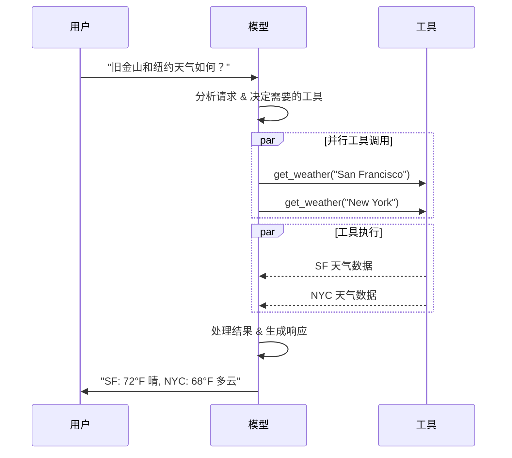

# LangChain Models（模型）

> 来源：https://docs.langchain.com/oss/python/langchain/models

---

## 概述

LLM 是强大的 AI 工具，能像人类一样理解和生成文本。除了文本生成，许多模型还支持：

- **工具调用** — 调用外部工具（数据库查询、API 调用）并在响应中使用结果
- **结构化输出** — 模型响应受限于预定义格式
- **多模态** — 处理和返回图像、音频、视频等非文本数据
- **推理** — 多步骤推理得出结论

模型是 Agent 的推理引擎，决定调用哪些工具、如何解读结果、何时给出最终答案。

---

## 基本用法

### 初始化模型

最简单的方式是使用 `init_chat_model`：

#### OpenAI

```bash
pip install -U "langchain[openai]"
```

```python
import os
from langchain.chat_models import init_chat_model

os.environ["OPENAI_API_KEY"] = "sk-..."
model = init_chat_model("gpt-5.4")
```

或直接使用 `ChatOpenAI`：

```python
from langchain_openai import ChatOpenAI
model = ChatOpenAI(model="gpt-5.4")
```

#### Anthropic (Claude)

```bash
pip install -U "langchain[anthropic]"
```

```python
import os
from langchain.chat_models import init_chat_model

os.environ["ANTHROPIC_API_KEY"] = "sk-..."
model = init_chat_model("claude-sonnet-4-6")
```

#### Google Gemini

```bash
pip install -U "langchain[google-genai]"
```

```python
import os
from langchain.chat_models import init_chat_model

os.environ["GOOGLE_API_KEY"] = "..."
model = init_chat_model("google_genai:gemini-2.5-flash-lite")
```

#### Azure OpenAI

```python
import os
from langchain.chat_models import init_chat_model

os.environ["AZURE_OPENAI_API_KEY"] = "..."
os.environ["AZURE_OPENAI_ENDPOINT"] = "..."
os.environ["OPENAI_API_VERSION"] = "2025-03-01-preview"

model = init_chat_model(
    "azure_openai:gpt-5.4",
    azure_deployment=os.environ["AZURE_OPENAI_DEPLOYMENT_NAME"],
)
```

#### AWS Bedrock

```bash
pip install -U "langchain[aws]"
```

```python
from langchain.chat_models import init_chat_model

model = init_chat_model(
    "anthropic.claude-3-5-sonnet-20240620-v1:0",
    model_provider="bedrock_converse",
)
```

#### HuggingFace

```bash
pip install -U "langchain[huggingface]"
```

```python
import os
from langchain.chat_models import init_chat_model

os.environ["HUGGINGFACEHUB_API_TOKEN"] = "hf_..."
model = init_chat_model(
    "microsoft/Phi-3-mini-4k-instruct",
    model_provider="huggingface",
    temperature=0.7,
    max_tokens=1024,
)
```

---

## 模型参数

| 参数 | 说明 |
|------|------|
| `model` | 模型名称，支持 `{provider}:{model}` 格式 |
| `api_key` | 认证密钥，通常通过环境变量设置 |
| `temperature` | 输出随机性，越高越有创造性，越低越确定 |
| `max_tokens` | 响应的最大 Token 数 |
| `timeout` | 超时时间（秒） |
| `max_retries` | 最大重试次数，默认 6（网络不稳定可增至 10-15） |

```python
model = init_chat_model(
    "claude-sonnet-4-6",
    temperature=0.7,
    timeout=30,
    max_tokens=1000,
    max_retries=6,
)
```

---

## 调用方法

### Invoke（调用）

最直接的方式——传入消息，获取完整响应：

```python
# 单条文本
response = model.invoke("Why do parrots have colorful feathers?")
print(response)

# 对话历史
conversation = [
    {"role": "system", "content": "You are a helpful assistant that translates English to French."},
    {"role": "user", "content": "Translate: I love programming."},
    {"role": "assistant", "content": "J'adore la programmation."},
    {"role": "user", "content": "Translate: I love building applications."}
]
response = model.invoke(conversation)
```

也可使用 LangChain 消息对象：

```python
from langchain.messages import HumanMessage, AIMessage, SystemMessage

conversation = [
    SystemMessage("You are a helpful assistant that translates English to French."),
    HumanMessage("Translate: I love programming."),
    AIMessage("J'adore la programmation."),
    HumanMessage("Translate: I love building applications.")
]
response = model.invoke(conversation)
```

### Stream（流式输出）

实时逐块返回输出，大幅改善用户体验：

```python
for chunk in model.stream("Why do parrots have colorful feathers?"):
    print(chunk.text, end="|", flush=True)
```

流式输出可以累加为完整消息：

```python
full = None
for chunk in model.stream("What color is the sky?"):
    full = chunk if full is None else full + chunk
    print(full.text)

# The → The sky → The sky is → The sky is typically → ...
```

#### 流式事件

```python
async for event in model.astream_events("Hello"):
    if event["event"] == "on_chat_model_start":
        print(f"Input: {event['data']['input']}")
    elif event["event"] == "on_chat_model_stream":
        print(f"Token: {event['data']['chunk'].text}")
    elif event["event"] == "on_chat_model_end":
        print(f"Full message: {event['data']['output'].text}")
```

### Batch（批量调用）

并行发送多个请求，提升性能：

```python
responses = model.batch([
    "Why do parrots have colorful feathers?",
    "How do airplanes fly?",
    "What is quantum computing?"
])
```

按完成顺序获取结果：

```python
for response in model.batch_as_completed([
    "Why do parrots have colorful feathers?",
    "How do airplanes fly?",
]):
    print(response)
```

控制并发数：

```python
model.batch(
    list_of_inputs,
    config={'max_concurrency': 5},
)
```

---

## 工具调用



### 绑定工具

```python
from langchain.tools import tool

@tool
def get_weather(location: str) -> str:
    """Get the weather at a location."""
    return f"It's sunny in {location}."

model_with_tools = model.bind_tools([get_weather])

response = model_with_tools.invoke("What's the weather like in Boston?")
for tool_call in response.tool_calls:
    print(f"Tool: {tool_call['name']}")
    print(f"Args: {tool_call['args']}")
```

### 工具执行循环

```python
model_with_tools = model.bind_tools([get_weather])

# 步骤1：模型生成工具调用
messages = [{"role": "user", "content": "What's the weather in Boston?"}]
ai_msg = model_with_tools.invoke(messages)
messages.append(ai_msg)

# 步骤2：执行工具并收集结果
for tool_call in ai_msg.tool_calls:
    tool_result = get_weather.invoke(tool_call)
    messages.append(tool_result)

# 步骤3：将结果传回模型获取最终响应
final_response = model_with_tools.invoke(messages)
print(final_response.text)
```

### 强制工具调用

```python
# 强制使用任意工具
model.bind_tools([tool_1], tool_choice="any")

# 强制使用特定工具
model.bind_tools([tool_1], tool_choice="tool_1")
```

### 并行工具调用

```python
response = model_with_tools.invoke("What's the weather in Boston and Tokyo?")
# 模型可能同时生成多个工具调用
print(response.tool_calls)
# [
#   {'name': 'get_weather', 'args': {'location': 'Boston'}, 'id': 'call_1'},
#   {'name': 'get_weather', 'args': {'location': 'Tokyo'}, 'id': 'call_2'},
# ]

# 禁用并行工具调用
model.bind_tools([get_weather], parallel_tool_calls=False)
```

### 流式工具调用

```python
gathered = None
for chunk in model_with_tools.stream("What's the weather in Boston?"):
    gathered = chunk if gathered is None else gathered + chunk
    print(gathered.tool_calls)
```

---

## 结构化输出

### Pydantic 模型（推荐）

```python
from pydantic import BaseModel, Field

class Movie(BaseModel):
    """A movie with details."""
    title: str = Field(description="The title of the movie")
    year: int = Field(description="The year the movie was released")
    director: str = Field(description="The director of the movie")
    rating: float = Field(description="The movie's rating out of 10")

model_with_structure = model.with_structured_output(Movie)
response = model_with_structure.invoke("Provide details about the movie Inception")
# Movie(title="Inception", year=2010, director="Christopher Nolan", rating=8.8)
```

### TypedDict

```python
from typing_extensions import TypedDict, Annotated

class MovieDict(TypedDict):
    title: Annotated[str, ..., "The title of the movie"]
    year: Annotated[int, ..., "The year the movie was released"]
    director: Annotated[str, ..., "The director of the movie"]
    rating: Annotated[float, ..., "The movie's rating out of 10"]

model_with_structure = model.with_structured_output(MovieDict)
```

### JSON Schema

```python
json_schema = {
    "title": "Movie",
    "type": "object",
    "properties": {
        "title": {"type": "string", "description": "The title of the movie"},
        "year": {"type": "integer", "description": "The year the movie was released"},
        "director": {"type": "string", "description": "The director of the movie"},
        "rating": {"type": "number", "description": "The movie's rating out of 10"},
    },
    "required": ["title", "year", "director", "rating"],
}
model_with_structure = model.with_structured_output(json_schema, method="json_schema")
```

### 关键注意事项

| 方面 | 说明 |
|------|------|
| `method` 参数 | `'json_schema'`：提供商原生；`'function_calling'`：通过工具调用模拟；`'json_mode'`：旧版方式 |
| `include_raw` | 设为 `True` 可同时获取原始 AIMessage 和解析后的结果 |
| 嵌套结构 | Pydantic 和 TypedDict 均支持嵌套 |

---

## 高级主题

### 模型配置文件（Profile）

```python
model.profile
# {
#   "max_input_tokens": 400000,
#   "image_inputs": True,
#   "reasoning_output": True,
#   "tool_calling": True,
#   ...
# }
```

自定义 Profile：

```python
custom_profile = {
    "max_input_tokens": 100_000,
    "tool_calling": True,
    "structured_output": True,
}
model = init_chat_model("...", profile=custom_profile)
```

### 多模态

模型可处理和返回非文本数据：

```python
# 输入图像
message = {
    "role": "user",
    "content": [
        {"type": "text", "text": "描述这张图片的内容。"},
        {"type": "image", "url": "https://example.com/image.jpg"},
    ]
}

# 输出图像
response = model.invoke("Create a picture of a cat")
print(response.content_blocks)
# [{"type": "text", "text": "..."}, {"type": "image", "base64": "...", "mime_type": "image/jpeg"}]
```

### 推理

```python
response = model.invoke("Why do parrots have colorful feathers?")
reasoning_steps = [b for b in response.content_blocks if b["type"] == "reasoning"]
```

### 本地模型

Ollama 是最简单的本地模型运行方式。

### 提示缓存

| 类型 | 提供商 | 说明 |
|------|--------|------|
| 隐式缓存 | OpenAI, Gemini | 自动传递缓存节省 |
| 显式缓存 | Anthropic, OpenAI, Gemini | 手动标记缓存点 |

### 速率限制

```python
from langchain_core.rate_limiters import InMemoryRateLimiter

rate_limiter = InMemoryRateLimiter(
    requests_per_second=0.1,     # 每 10 秒 1 个请求
    check_every_n_seconds=0.1,   # 每 100ms 检查一次
    max_bucket_size=10,          # 最大突发大小
)

model = init_chat_model(
    model="gpt-5.4",
    model_provider="openai",
    rate_limiter=rate_limiter,
)
```

### Token 使用追踪

```python
from langchain_core.callbacks import get_usage_metadata_callback

model_1 = init_chat_model(model="gpt-5.4-mini")
model_2 = init_chat_model(model="claude-haiku-4-5-20251001")

with get_usage_metadata_callback() as cb:
    model_1.invoke("Hello")
    model_2.invoke("Hello")
    print(cb.usage_metadata)
```

### 可配置模型

运行时切换模型：

```python
configurable_model = init_chat_model(temperature=0)

configurable_model.invoke(
    "what's your name",
    config={"configurable": {"model": "gpt-5-nano"}},
)
configurable_model.invoke(
    "what's your name",
    config={"configurable": {"model": "claude-sonnet-4-6"}},
)
```

带默认值和前缀：

```python
first_model = init_chat_model(
    model="gpt-5.4-mini",
    temperature=0,
    configurable_fields=("model", "model_provider", "temperature", "max_tokens"),
    config_prefix="first",
)

first_model.invoke(
    "what's your name",
    config={"configurable": {
        "first_model": "claude-sonnet-4-6",
        "first_temperature": 0.5,
        "first_max_tokens": 100,
    }},
)
```
