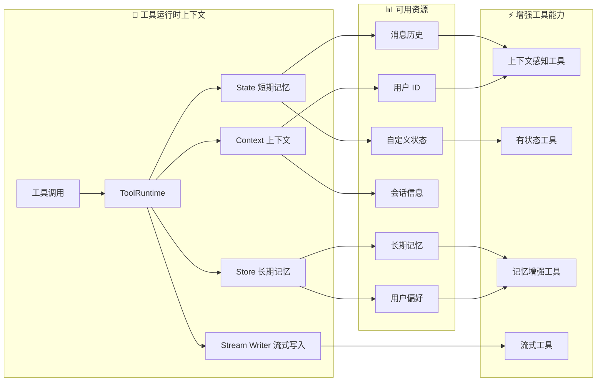

# LangChain Tools（工具）

> 来源：https://docs.langchain.com/oss/python/langchain/tools

---

## 概述

工具扩展了 Agent 的能力——让它们能获取实时数据、执行代码、查询外部数据库、在世界上采取行动。

工具本质是**带有明确定义输入输出的可调用函数**，传给聊天模型后，模型根据对话上下文决定何时调用、传什么参数。



---

## 创建工具

### 基本定义

使用 `@tool` 装饰器，函数的 docstring 自动成为工具描述：

```python
from langchain.tools import tool

@tool
def search_database(query: str, limit: int = 10) -> str:
    """Search the customer database for records matching the query.

    Args:
        query: Search terms to look for
        limit: Maximum number of results to return
    """
    return f"Found {limit} results for '{query}'"
```

> 💡 类型注解是**必需的**，它们定义了工具的输入 schema。docstring 应信息丰富且简洁，帮助模型理解工具用途。

> 🐞 推荐 `snake_case` 命名工具（如 `web_search`），某些提供商会拒绝含空格或特殊字符的名称。

### 自定义工具属性

#### 自定义名称

```python
@tool("web_search")  # 自定义名称
def search(query: str) -> str:
    """Search the web for information."""
    return f"Results for: {query}"

print(search.name)  # web_search
```

#### 自定义描述

```python
@tool("calculator", description="Performs arithmetic calculations. Use this for any math problems.")
def calc(expression: str) -> str:
    """Evaluate mathematical expressions."""
    return str(eval(expression))
```

### 高级 Schema 定义

#### 使用 Pydantic

```python
from pydantic import BaseModel, Field
from typing import Literal

class WeatherInput(BaseModel):
    """Input for weather queries."""
    location: str = Field(description="City name or coordinates")
    units: Literal["celsius", "fahrenheit"] = Field(
        default="celsius",
        description="Temperature unit preference"
    )
    include_forecast: bool = Field(
        default=False,
        description="Include 5-day forecast"
    )

@tool(args_schema=WeatherInput)
def get_weather(location: str, units: str = "celsius", include_forecast: bool = False) -> str:
    """Get current weather and optional forecast."""
    temp = 22 if units == "celsius" else 72
    result = f"Current weather in {location}: {temp} degrees {units[0].upper()}"
    if include_forecast:
        result += "\nNext 5 days: Sunny"
    return result
```

#### 使用 JSON Schema

```python
weather_schema = {
    "type": "object",
    "properties": {
        "location": {"type": "string"},
        "units": {"type": "string"},
        "include_forecast": {"type": "boolean"},
    },
    "required": ["location", "units", "include_forecast"],
}

@tool(args_schema=weather_schema)
def get_weather(location: str, units: str = "celsius", include_forecast: bool = False) -> str:
    """Get current weather and optional forecast."""
    ...
```

### 保留参数名

以下参数名已被保留，不能作为工具参数使用：

| 参数名 | 用途 |
|--------|------|
| `config` | 内部传递 `RunnableConfig` |
| `runtime` | `ToolRuntime` 参数（访问状态、上下文、存储） |

---

## 访问上下文

工具通过 `ToolRuntime` 参数访问运行时信息：

| 组件 | 说明 | 用途 |
|------|------|------|
| **State** | 短期记忆 — 当前对话中的可变数据 | 访问对话历史、追踪工具调用次数 |
| **Context** | 调用时传入的不可变配置 | 根据用户身份个性化响应 |
| **Store** | 长期记忆 — 跨对话持久化数据 | 保存用户偏好、维护知识库 |
| **Stream Writer** | 工具执行期间发送实时更新 | 长时间运行操作的进度反馈 |
| **Execution Info** | 当前执行的标识和重试信息 | 访问线程/运行 ID |
| **Server Info** | LangGraph Server 上的元数据 | 访问 assistant ID、graph ID |

### 短期记忆（State）

在工具签名中添加 `runtime: ToolRuntime`（自动注入，对 LLM 不可见）：

```python
from langchain.tools import tool, ToolRuntime
from langchain.messages import HumanMessage

# 访问状态
@tool
def get_last_user_message(runtime: ToolRuntime) -> str:
    """Get the most recent message from the user."""
    messages = runtime.state["messages"]
    for message in reversed(messages):
        if isinstance(message, HumanMessage):
            return message.content
    return "No user messages found"

# 访问自定义状态字段
@tool
def get_user_preference(pref_name: str, runtime: ToolRuntime) -> str:
    """Get a user preference value."""
    preferences = runtime.state.get("user_preferences", {})
    return preferences.get(pref_name, "Not set")
```

#### 更新状态

使用 `Command` 更新 Agent 状态：

```python
from langchain.agents import AgentState
from langchain.messages import ToolMessage
from langchain.tools import ToolRuntime, tool
from langgraph.types import Command

class CustomState(AgentState):
    user_name: str

@tool
def set_user_name(new_name: str, runtime: ToolRuntime[None, CustomState]) -> Command:
    """Set the user's name in the conversation state."""
    return Command(
        update={
            "user_name": new_name,
            "messages": [
                ToolMessage(
                    content=f"User name set to {new_name}.",
                    tool_call_id=runtime.tool_call_id,
                )
            ],
        }
    )
```

> 💡 当工具更新状态变量时，建议为这些字段定义 reducer。LLM 可能并行调用多个工具，reducer 决定如何解决冲突。

### Context（上下文）

不可变配置数据，调用时传入：

```python
from dataclasses import dataclass
from langchain.agents import create_agent
from langchain.tools import tool, ToolRuntime

USER_DATABASE = {
    "user123": {"name": "Alice Johnson", "account_type": "Premium", "balance": 5000},
    "user456": {"name": "Bob Smith", "account_type": "Standard", "balance": 1200},
}

@dataclass
class UserContext:
    user_id: str

@tool
def get_account_info(runtime: ToolRuntime[UserContext]) -> str:
    """Get the current user's account information."""
    user_id = runtime.context.user_id
    if user_id in USER_DATABASE:
        user = USER_DATABASE[user_id]
        return f"Account holder: {user['name']}\nType: {user['account_type']}\nBalance: ${user['balance']}"
    return "User not found"

agent = create_agent(
    model,
    tools=[get_account_info],
    context_schema=UserContext,
    system_prompt="You are a financial assistant.",
)

result = agent.invoke(
    {"messages": [{"role": "user", "content": "What's my current balance?"}]},
    context=UserContext(user_id="user123"),
)
```

### 长期记忆（Store）

跨对话持久化存储：

```python
from typing import Any
from langgraph.store.memory import InMemoryStore
from langchain.agents import create_agent
from langchain.tools import tool, ToolRuntime

# 读取记忆
@tool
def get_user_info(user_id: str, runtime: ToolRuntime) -> str:
    """Look up user info."""
    store = runtime.store
    user_info = store.get(("users",), user_id)
    return str(user_info.value) if user_info else "Unknown user"

# 写入记忆
@tool
def save_user_info(user_id: str, user_info: dict[str, Any], runtime: ToolRuntime) -> str:
    """Save user info."""
    store = runtime.store
    store.put(("users",), user_id, user_info)
    return "Successfully saved user info."

store = InMemoryStore()
agent = create_agent(model, tools=[get_user_info, save_user_info], store=store)

# 第一个会话：保存用户信息
agent.invoke({
    "messages": [{"role": "user", "content": "Save user: abc123, name: Foo, age: 25"}]
})

# 第二个会话：读取用户信息（数据跨会话保留！）
agent.invoke({
    "messages": [{"role": "user", "content": "Get user info for 'abc123'"}]
})
```

> 🐞 生产环境请使用 `PostgresStore` 等持久化存储，`InMemoryStore` 仅用于开发。

### Stream Writer（流式写入）

长时间运行时发送实时进度：

```python
from langchain.tools import tool, ToolRuntime

@tool
def get_weather(city: str, runtime: ToolRuntime) -> str:
    """Get weather for a given city."""
    writer = runtime.stream_writer
    writer(f"Looking up data for city: {city}")
    writer(f"Acquired data for city: {city}")
    return f"It's always sunny in {city}!"
```

> 使用 `stream_writer` 的工具必须在 LangGraph 执行上下文中调用。

### Execution Info（执行信息）

```python
from langchain.tools import tool, ToolRuntime

@tool
def log_execution_context(runtime: ToolRuntime) -> str:
    """Log execution identity information."""
    info = runtime.execution_info
    print(f"Thread: {info.thread_id}, Run: {info.run_id}")
    print(f"Attempt: {info.node_attempt}")
    return "done"
```

### Server Info（服务端信息）

```python
from langchain.tools import tool, ToolRuntime

@tool
def get_assistant_scoped_data(runtime: ToolRuntime) -> str:
    """Fetch data scoped to the current assistant."""
    server = runtime.server_info
    if server is not None:
        print(f"Assistant: {server.assistant_id}, Graph: {server.graph_id}")
        if server.user is not None:
            print(f"User: {server.user.identity}")
    return "done"
```

> `server_info` 在非 LangGraph Server 环境下为 `None`。

---

## ToolNode

`ToolNode` 是 LangGraph 工作流中执行工具的预构建节点，自动处理并行执行、错误处理和状态注入。

### 基本用法

```python
from langchain.tools import tool
from langgraph.prebuilt import ToolNode
from langgraph.graph import StateGraph, MessagesState, START, END

@tool
def search(query: str) -> str:
    """Search for information."""
    return f"Results for: {query}"

@tool
def calculator(expression: str) -> str:
    """Evaluate a math expression."""
    return str(eval(expression))

tool_node = ToolNode([search, calculator])

builder = StateGraph(MessagesState)
builder.add_node("tools", tool_node)
```

### 工具返回值

#### 返回字符串

```python
@tool
def get_weather(city: str) -> str:
    """Get weather for a city."""
    return f"It is currently sunny in {city}."
```

行为：返回值转换为 `ToolMessage`，模型看到文本后决定下一步。

#### 返回对象

```python
@tool
def get_weather_data(city: str) -> dict:
    """Get structured weather data for a city."""
    return {"city": city, "temperature_c": 22, "conditions": "sunny"}
```

行为：对象序列化后作为工具输出，模型可读取特定字段进行推理。

#### 返回 Command

```python
from langchain.messages import ToolMessage
from langgraph.types import Command

@tool
def set_language(language: str, runtime: ToolRuntime) -> Command:
    """Set the preferred response language."""
    return Command(
        update={
            "preferred_language": language,
            "messages": [
                ToolMessage(
                    content=f"Language set to {language}.",
                    tool_call_id=runtime.tool_call_id,
                )
            ],
        }
    )
```

行为：Command 更新图状态，更新后的状态在同一次运行的后续步骤中可用。

### 错误处理

```python
from langgraph.prebuilt import ToolNode

# 默认：捕获调用错误，重新抛出执行错误
tool_node = ToolNode(tools)

# 捕获所有错误并返回错误消息给 LLM
tool_node = ToolNode(tools, handle_tool_errors=True)

# 自定义错误消息
tool_node = ToolNode(tools, handle_tool_errors="Something went wrong, please try again.")

# 自定义错误处理器
def handle_error(e: ValueError) -> str:
    return f"Invalid input: {e}"

tool_node = ToolNode(tools, handle_tool_errors=handle_error)

# 仅捕获特定异常类型
tool_node = ToolNode(tools, handle_tool_errors=(ValueError, TypeError))
```

### 条件路由

```python
from langgraph.prebuilt import ToolNode, tools_condition
from langgraph.graph import StateGraph, MessagesState, START, END

builder = StateGraph(MessagesState)
builder.add_node("llm", call_llm)
builder.add_node("tools", ToolNode(tools))

builder.add_edge(START, "llm")
builder.add_conditional_edges("llm", tools_condition)  # 路由到 "tools" 或 END
builder.add_edge("tools", "llm")

graph = builder.compile()
```

### 状态注入

```python
from langchain.tools import tool, ToolRuntime
from langgraph.prebuilt import ToolNode

@tool
def get_message_count(runtime: ToolRuntime) -> str:
    """Get the number of messages in the conversation."""
    messages = runtime.state["messages"]
    return f"There are {len(messages)} messages."

tool_node = ToolNode([get_message_count])
```

---

## 预构建工具

LangChain 提供大量预构建工具和工具包，涵盖常见任务如网络搜索、代码解释、数据库访问等。

详见 [LangChain 工具集成页面](https://docs.langchain.com/oss/python/langchain/tools)。

## 服务端工具

某些聊天模型具有内置的服务端工具（如网络搜索、代码解释器），无需自行定义或托管工具逻辑。

详见各聊天模型集成页面和工具调用文档。
