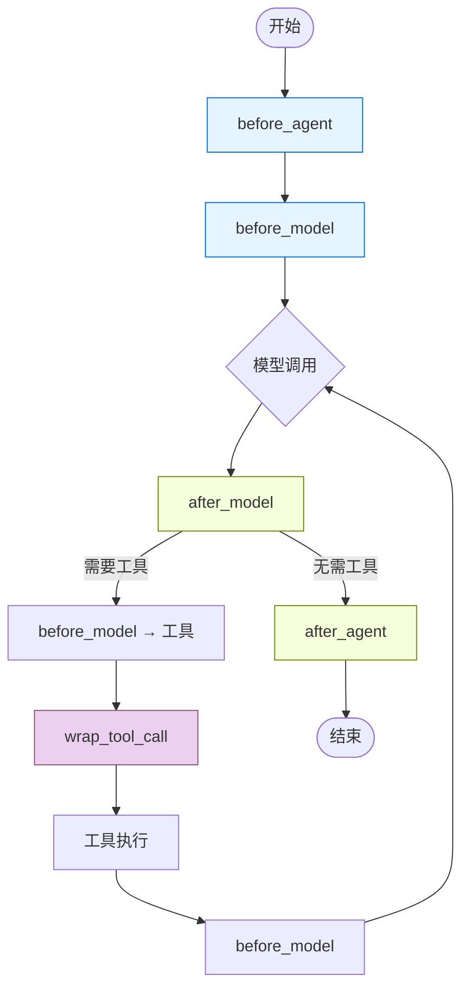

# LangChain Middleware 概述

> 来源：https://docs.langchain.com/oss/python/langchain/middleware/overview

---

## 概述

中间件提供了一种在 Agent 内部更紧密地控制执行流程的方式，适用于：

- **追踪** Agent 行为（日志、分析、调试）
- **转换** 提示词、工具选择和输出格式
- **添加** 重试、回退和提前终止逻辑
- **应用** 速率限制、护栏和 PII 检测

```python
from langchain.agents import create_agent
from langchain.agents.middleware import SummarizationMiddleware, HumanInTheLoopMiddleware

agent = create_agent(
    model="gpt-5.4",
    tools=[...],
    middleware=[
        SummarizationMiddleware(...),
        HumanInTheLoopMiddleware(...),
    ],
)
```

---

## Agent 循环与中间件钩子

核心 Agent 循环：调用模型 → 模型选择工具 → 执行工具 → 循环或结束



### 钩子类型

#### 节点式钩子（Node-style）

按顺序在特定执行点运行：

| 钩子 | 时机 | 用途 |
|------|------|------|
| `before_agent` | Agent 启动前（每次调用一次） | 初始化、前置检查 |
| `before_model` | 每次模型调用前 | 消息裁剪、上下文注入 |
| `after_model` | 每次模型响应后 | 护栏、内容过滤 |
| `after_agent` | Agent 完成后（每次调用一次） | 日志、清理 |

#### 包裹式钩子（Wrap-style）

围绕每次调用运行，控制是否/何时调用 handler：

| 钩子 | 时机 | 用途 |
|------|------|------|
| `wrap_model_call` | 围绕每次模型调用 | 重试、回退、缓存、动态模型选择 |
| `wrap_tool_call` | 围绕每次工具调用 | 错误处理、监控、重试 |

---

## 相关文档

| 文档 | 说明 |
|------|------|
| [内置中间件](./10-middleware-built-in.md) | 预构建的常用中间件 |
| [自定义中间件](./11-middleware-custom.md) | 用钩子和装饰器构建自己的中间件 |
