# LangChain 自定义中间件

> 来源：https://docs.langchain.com/oss/python/langchain/middleware/custom

---

## 概述

通过实现特定执行点的钩子来构建自定义中间件。

---

## 钩子类型

### 节点式钩子（Node-style）

按顺序在特定执行点运行，用于日志、验证、状态更新：

| 钩子 | 时机 |
|------|------|
| `before_agent` | Agent 启动前（每次调用一次） |
| `before_model` | 每次模型调用前 |
| `after_model` | 每次模型响应后 |
| `after_agent` | Agent 完成后（每次调用一次） |

### 包裹式钩子（Wrap-style）

围绕每次调用运行，控制 handler 的调用时机：

| 钩子 | 时机 |
|------|------|
| `wrap_model_call` | 围绕每次模型调用 |
| `wrap_tool_call` | 围绕每次工具调用 |

> 💡 包裹式钩子可决定：不调用 handler（短路）、调用一次（正常）、调用多次（重试）。

---

## 创建方式

### 方式一：装饰器（简单快速）

适用于单钩子、无复杂配置的场景：

```python
from langchain.agents.middleware import (
    before_model,
    after_model,
    wrap_model_call,
    AgentState,
    ModelRequest,
    ModelResponse,
)
from langgraph.runtime import Runtime
from typing import Any, Callable

@before_model(can_jump_to=["end"])
def check_message_limit(state: AgentState, runtime: Runtime) -> dict[str, Any] | None:
    if len(state["messages"]) >= 50:
        return {
            "messages": [AIMessage("Conversation limit reached.")],
            "jump_to": "end"
        }
    return None

@after_model
def log_response(state: AgentState, runtime: Runtime) -> dict[str, Any] | None:
    print(f"Model returned: {state['messages'][-1].content}")
    return None

@wrap_model_call
def retry_model(request: ModelRequest, handler: Callable) -> ModelResponse:
    for attempt in range(3):
        try:
            return handler(request)
        except Exception as e:
            if attempt == 2:
                raise
            print(f"Retry {attempt + 1}/3 after error: {e}")

agent = create_agent(
    model="gpt-5.4",
    middleware=[check_message_limit, log_response, retry_model],
    tools=[...],
)
```

### 方式二：类（更强大）

适用于多钩子、需要配置、需同时实现同步/异步的场景：

```python
from langchain.agents.middleware import AgentMiddleware, AgentState, ModelRequest, ModelResponse
from langgraph.runtime import Runtime
from typing import Any, Callable

class LoggingMiddleware(AgentMiddleware):
    def before_model(self, state: AgentState, runtime: Runtime) -> dict[str, Any] | None:
        print(f"About to call model with {len(state['messages'])} messages")
        return None

    def after_model(self, state: AgentState, runtime: Runtime) -> dict[str, Any] | None:
        print(f"Model returned: {state['messages'][-1].content}")
        return None

    async def abefore_model(self, state: AgentState, runtime: Runtime) -> dict[str, Any] | None:
        # 异步版本
        return None

    async def aafter_model(self, state: AgentState, runtime: Runtime) -> dict[str, Any] | None:
        print(f"Model returned: {state['messages'][-1].content}")
        return None

agent = create_agent(
    model="gpt-5.4",
    middleware=[LoggingMiddleware()],
    tools=[...],
)
```

---

## 状态更新

### 节点式钩子

直接返回 dict 来更新状态：

```python
from typing_extensions import NotRequired

class TrackingState(AgentState):
    model_call_count: NotRequired[int]

@after_model(state_schema=TrackingState)
def increment_counter(state: TrackingState, runtime: Runtime) -> dict[str, Any] | None:
    return {"model_call_count": state.get("model_call_count", 0) + 1}
```

### 包裹式钩子

返回 `ExtendedModelResponse`（含 `Command`）来注入状态更新：

```python
from langchain.agents.middleware import ExtendedModelResponse
from langgraph.types import Command

class UsageTrackingState(AgentState):
    last_model_call_tokens: NotRequired[int]

@wrap_model_call(state_schema=UsageTrackingState)
def track_usage(request: ModelRequest, handler: Callable) -> ExtendedModelResponse:
    response = handler(request)
    return ExtendedModelResponse(
        model_response=response,
        command=Command(update={"last_model_call_tokens": 150}),
    )
```

#### 多中间件组合

当多个中间件返回 `ExtendedModelResponse` 时：
- **Commands 通过 reducer 应用**：消息是累加的
- **外层优先**：非 reducer 字段，外层中间件的值覆盖内层
- **重试安全**：外层重试时，早期调用的 commands 被丢弃

---

## 自定义状态 Schema

中间件可扩展 Agent 状态来追踪自定义属性：

```python
class CustomState(AgentState):
    model_call_count: NotRequired[int]
    user_id: NotRequired[str]

class CallCounterMiddleware(AgentMiddleware[CustomState]):
    state_schema = CustomState

    def before_model(self, state: CustomState, runtime) -> dict[str, Any] | None:
        count = state.get("model_call_count", 0)
        if count > 10:
            return {"jump_to": "end"}
        return None

    def after_model(self, state: CustomState, runtime) -> dict[str, Any] | None:
        return {"model_call_count": state.get("model_call_count", 0) + 1}
```

---

## 执行顺序

```python
agent = create_agent(
    model="gpt-5.4",
    middleware=[middleware1, middleware2, middleware3],
)
```



```mermaid
graph TD
    subgraph "Before 钩子 — 顺序执行"
        B1["1. middleware1.before_agent"] --> B2["2. middleware2.before_agent"] --> B3["3. middleware3.before_agent"]
    end

    subgraph "Before Model — 顺序执行"
        BM1["1. middleware1.before_model"] --> BM2["2. middleware2.before_model"] --> BM3["3. middleware3.before_model"]
    end

    subgraph "Wrap Model — 嵌套执行"
        W1["1. middleware1.wrap_model_call"] --> W2["2. middleware2.wrap_model_call"] --> W3["3. middleware3.wrap_model_call"] --> MODEL["模型"]
    end

    subgraph "After Model — 逆序执行"
        AM1["1. middleware3.after_model"] --> AM2["2. middleware2.after_model"] --> AM3["3. middleware1.after_model"]
    end

    subgraph "After 钩子 — 逆序执行"
        A1["1. middleware3.after_agent"] --> A2["2. middleware2.after_agent"] --> A3["3. middleware1.after_agent"]
    end
```

**核心规则：**
- `before_*` 钩子：从先到后
- `after_*` 钩子：从后到先（逆序）
- `wrap_*` 钩子：嵌套（第一个中间件包裹所有其他）

---

## Agent 跳转

通过返回 `jump_to` 提前退出中间件：

```python
@after_model
@hook_config(can_jump_to=["end"])
def check_for_blocked(state: AgentState, runtime: Runtime) -> dict[str, Any] | None:
    last_message = state["messages"][-1]
    if "BLOCKED" in last_message.content:
        return {
            "messages": [AIMessage("I cannot respond to that request.")],
            "jump_to": "end"
        }
    return None
```

**可用跳转目标：**

| 目标 | 说明 |
|------|------|
| `'end'` | 跳到 Agent 执行末尾 |
| `'tools'` | 跳到工具节点 |
| `'model'` | 跳到模型节点 |

---

## 常见示例

### 动态提示词

```python
@wrap_model_call
def add_context(request: ModelRequest, handler: Callable) -> ModelResponse:
    new_content = list(request.system_message.content_blocks) + [
        {"type": "text", "text": "Additional context."}
    ]
    new_system_message = SystemMessage(content=new_content)
    return handler(request.override(system_message=new_system_message))
```

> 💡 `ModelRequest.system_message` 始终是 `SystemMessage` 对象，即使 Agent 用字符串 `system_prompt` 创建。

### 动态模型选择

```python
complex_model = init_chat_model("claude-sonnet-4-6")
simple_model = init_chat_model("claude-haiku-4-5-20251001")

@wrap_model_call
def dynamic_model(request: ModelRequest, handler: Callable) -> ModelResponse:
    if len(request.messages) > 10:
        model = complex_model
    else:
        model = simple_model
    return handler(request.override(model=model))
```

### 动态工具选择

```python
@wrap_model_call
def select_tools(request: ModelRequest, handler: Callable) -> ModelResponse:
    relevant_tools = select_relevant_tools(request.state, request.runtime)
    return handler(request.override(tools=relevant_tools))
```

### 工具调用监控

```python
@wrap_tool_call
def monitor_tool(request: ToolCallRequest, handler: Callable) -> ToolMessage | Command:
    print(f"Executing tool: {request.tool_call['name']}")
    print(f"Arguments: {request.tool_call['args']}")
    try:
        result = handler(request)
        print("Tool completed successfully")
        return result
    except Exception as e:
        print(f"Tool failed: {e}")
        raise
```

### Anthropic 提示缓存

```python
@wrap_model_call
def add_cached_context(request: ModelRequest, handler: Callable) -> ModelResponse:
    new_content = list(request.system_message.content_blocks) + [
        {
            "type": "text",
            "text": "Here is a large document to analyze:\n\n<document>...</document>",
            "cache_control": {"type": "ephemeral"}  # 缓存此内容
        }
    ]
    new_system_message = SystemMessage(content=new_content)
    return handler(request.override(system_message=new_system_message))
```

---

## 最佳实践

1. **保持聚焦** — 每个中间件做好一件事
2. **优雅处理错误** — 别让中间件错误搞崩 Agent
3. **选择合适的钩子类型**：
   - 节点式 → 顺序逻辑（日志、验证）
   - 包裹式 → 控制流（重试、回退、缓存）
4. **文档化自定义状态属性**
5. **先独立测试再集成**
6. **注意执行顺序** — 关键中间件放前面
7. **优先使用内置中间件**
