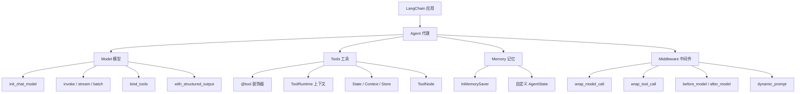

# LangChain Python 中文文档

> 基于 LangChain 官方文档整理，本地独立版本
> 更新时间：2026-05-09

---

## 📚 文档目录

| 序号 | 文档 | 内容 |
|------|------|------|
| 00 | [安装指南](./00-install.md) | LangChain 核心包及集成包安装 |
| 01 | [快速开始](./01-quickstart.md) | 几分钟内构建第一个 Agent |
| 02 | [Agents 智能代理](./02-agents.md) | 模型 + 工具 + 推理循环 |
| 03 | [Models 模型](./03-models.md) | 初始化、调用、工具绑定、结构化输出 |
| 04 | [Messages 消息](./04-messages.md) | 消息类型、内容块、多模态 |
| 05 | [Tools 工具](./05-tools.md) | 工具创建、运行时上下文、ToolNode |
| 06 | [短期记忆](./06-short-term-memory.md) | Checkpointer、裁剪/删除/摘要消息 |
| 07 | [流式输出](./07-streaming.md) | Agent 进度、LLM Token、自定义更新、多模式 |
| 08 | [结构化输出](./08-structured-output.md) | ProviderStrategy、ToolStrategy、错误处理 |
| 09 | [中间件概述](./09-middleware-overview.md) | 钩子类型、Agent 循环 |
| 10 | [内置中间件](./10-middleware-built-in.md) | 16 种预构建中间件详解 |
| 11 | [自定义中间件](./11-middleware-custom.md) | 装饰器/类、状态更新、执行顺序 |

## 🏗️ LangChain 核心架构



## 🔗 快速参考

### 安装

```bash
pip install -U langchain langchain-openai
```

### 最小 Agent 示例

```python
from langchain.agents import create_agent

def get_weather(city: str) -> str:
    """Get weather for a city."""
    return f"It's sunny in {city}!"

agent = create_agent(
    model="openai:gpt-5.4",
    tools=[get_weather],
    system_prompt="You are a helpful assistant",
)

result = agent.invoke(
    {"messages": [{"role": "user", "content": "Weather in SF?"}]}
)
```

### 关键导入

```python
# 模型
from langchain.chat_models import init_chat_model

# 消息
from langchain.messages import HumanMessage, AIMessage, SystemMessage, ToolMessage

# 工具
from langchain.tools import tool, ToolRuntime

# Agent
from langchain.agents import create_agent, AgentState

# 记忆
from langgraph.checkpoint.memory import InMemorySaver
```
