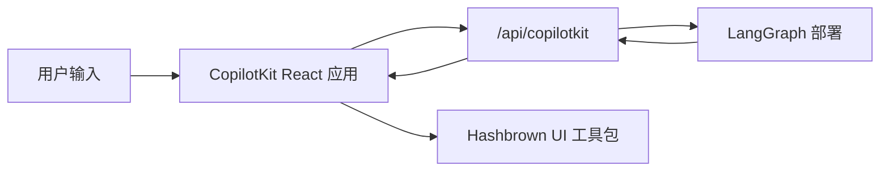

# CopilotKit

> 为 LangGraph 部署添加自定义 CopilotKit 端点，并在 React 中渲染结构化生成式 UI

CopilotKit 提供完整的 React 聊天运行时，当你希望代理返回结构化 UI 负载而非纯文本时，它与 LangGraph 配合得特别好。在这种模式下，你的 LangGraph 部署同时提供图 API 和自定义 CopilotKit 端点，而前端将助手消息解析为动态的 React 组件。

当你需要以下功能时，这种方式非常有用：

- 现成的聊天运行时，无需自己连接 `stream.messages`
- 自定义服务器端点，可以在已部署的图旁边添加特定于提供商的行为
- 从受约束的组件注册表中渲染结构化生成式 UI

关于 CopilotKit 特定的 API、UI 模式和运行时配置，请参阅 [CopilotKit 文档](https://docs.copilotkit.ai/)。

## 工作原理

从高层次来看，CopilotKit 位于你的 React 应用和 LangGraph 部署之间。前端将对话状态发送到与图 API 一起挂载的自定义 `/api/copilotkit` 路由，该路由将请求转发到 LangGraph，响应返回时包含助手消息以及你的组件注册表可以渲染的任何结构化 UI 负载。

1. 像往常一样使用 LangSmith 或 LangGraph 开发服务器部署图。
2. 使用挂载在图 API 旁边的 HTTP 应用扩展部署。
3. 用 `CopilotKit` 包裹前端，并将其指向该自定义运行时 URL。
4. 注册动态 UI 组件，并在渲染时将助手响应解析为这些组件。



## 安装

后端端点：

```bash
uv add copilotkit ag-ui-langgraph fastapi uvicorn

```

前端应用：

```bash
bun add @copilotkit/react-core @copilotkit/react-ui @hashbrownai/core @hashbrownai/react

```

## 使用自定义端点扩展 LangGraph 部署

核心思想是 LangGraph 部署不仅服务于图。它还可以加载 HTTP 应用，这让你可以在部署本身旁边挂载额外的路由。

在 `langgraph.json` 中，将 `http.app` 指向你的自定义应用入口点：

```json
{
  "dependencies": ["."],
  "graphs": {
    "copilotkit_shadify": "./main.py:agent"
  },
  "http": {
    "app": "./main.py:app"
  }
}

```

在 Python 中，创建一个 `FastAPI` 应用，并通过 CopilotKit 的 AG-UI 桥接暴露 LangGraph 代理：

```python
from typing import Any, TypedDict

from ag_ui_langgraph import add_langgraph_fastapi_endpoint
from copilotkit import CopilotKitMiddleware, CopilotKitState, LangGraphAGUIAgent
from fastapi import FastAPI
from langchain.agents import create_agent

from src.middleware import apply_structured_output_schema, normalize_context

class AgentState(CopilotKitState):
    pass

class AgentContext(TypedDict, total=False):
    output_schema: dict[str, Any]

agent = create_agent(
    model="openai:gpt-5.2",
    middleware=[
        normalize_context,
        CopilotKitMiddleware(),
        apply_structured_output_schema,
    ],
    context_schema=AgentContext,
    state_schema=AgentState,
    system_prompt=(
        "You are a helpful UI assistant. Build visual responses using the "
        "available components."
    ),
)

app = FastAPI()

add_langgraph_fastapi_endpoint(
    app=app,
    agent=LangGraphAGUIAgent(
        name="copilotkit_shadify",
        description="A UI assistant that returns structured component payloads.",
        graph=agent,
    ),
    path="/",
)

```

这个自定义应用是重要的扩展点：它在不替换底层 LangGraph 部署的情况下，挂载了一个支持 CopilotKit 的运行时。

在 Python 中，等效的工作在中间件中完成：规范化 CopilotKit 上下文，并将 `output_schema` 从 `useAgentContext(...)` 转发到模型的结构化输出配置。

```python
import json
from collections.abc import Mapping

from langchain.agents.middleware import before_agent, wrap_model_call
from langchain.agents.structured_output import ProviderStrategy

@wrap_model_call
async def apply_structured_output_schema(request, handler):
    schema = None
    runtime = getattr(request, "runtime", None)
    runtime_context = getattr(runtime, "context", None)

    if isinstance(runtime_context, Mapping):
        schema = runtime_context.get("output_schema")

    if schema is None and isinstance(getattr(request, "state", None), dict):
        copilot_context = request.state.get("copilotkit", {}).get("context")
        if isinstance(copilot_context, list):
            for item in copilot_context:
                if isinstance(item, dict) and item.get("description") == "output_schema":
                    schema = item.get("value")
                    break

    if isinstance(schema, str):
        try:
            schema = json.loads(schema)
        except json.JSONDecodeError:
            schema = None

    if isinstance(schema, dict):
        request = request.override(
            response_format=ProviderStrategy(schema=schema, strict=True),
        )

    return await handler(request)

@before_agent
def normalize_context(state, runtime):
    copilotkit_state = state.get("copilotkit", {})
    context = copilotkit_state.get("context")

    if isinstance(context, list):
        normalized = [
            item.model_dump() if hasattr(item, "model_dump") else item
            for item in context
        ]
        return {"copilotkit": {**copilotkit_state, "context": normalized}}

    return None

```

结果是关注点清晰分离：

- LangGraph 仍然拥有图执行和持久化
- CopilotKit 拥有面向聊天的运行时契约
- 你的自定义端点在一个部署中将它们粘合在一起

## 构建前端应用结构

在前端，用 `CopilotKit` 包裹你的应用，并将其指向自定义运行时 URL：

```tsx
import { CopilotKit } from "@copilotkit/react-core";
import { CopilotChat, useAgentContext } from "@copilotkit/react-core/v2";
import { s } from "@hashbrownai/core";

import { useChatKit } from "@/components/chat/chat-kit";
import { chatTheme } from "@/lib/chat-theme";

export function App() {
  return (
    <CopilotKit runtimeUrl={import.meta.env.VITE_RUNTIME_URL ?? "/api/copilotkit"}>
      <Page />
    </CopilotKit>
  );
}

function Page() {
  const chatKit = useChatKit();

  useAgentContext({
    description: "output_schema",
    value: s.toJsonSchema(chatKit.schema),
  });

  return <CopilotChat {...chatTheme} />;
}

```

这里有两个重要的部分：

- `runtimeUrl="/api/copilotkit"` 将聊天发送到你的自定义后端路由，而不是直接发送到原始的 LangGraph API
- `useAgentContext(...)` 将 UI 模式发送给代理，使模型知道它应该生成什么结构化输出格式

## 注册动态组件

组件注册表位于 `useChatKit()` 中。这是你定义代理允许发出的组件集合的地方，例如卡片、行、列、图表、代码块和按钮。

```tsx
import { s } from "@hashbrownai/core";
import { exposeComponent, exposeMarkdown, useUiKit } from "@hashbrownai/react";

import { Button } from "@/components/ui/button";
import { Card } from "@/components/ui/card";
import { CodeBlock } from "@/components/ui/code-block";
import { Row, Column } from "@/components/ui/layout";
import { SimpleChart } from "@/components/ui/simple-chart";

export function useChatKit() {
  return useUiKit({
    components: [
      exposeMarkdown(),
      exposeComponent(Card, {
        name: "card",
        description: "Card to wrap generative UI content.",
        children: "any",
      }),
      exposeComponent(Row, {
        name: "row",
        props: {
          gap: s.string("Tailwind gap size") as never,
        },
        children: "any",
      }),
      exposeComponent(Column, {
        name: "column",
        children: "any",
      }),
      exposeComponent(SimpleChart, {
        name: "chart",
        props: {
          labels: s.array("Category labels", s.string("A label")),
          values: s.array("Numeric values", s.number("A value")),
        },
        children: false,
      }),
      exposeComponent(CodeBlock, {
        name: "code_block",
        props: {
          code: s.streaming.string("The code to display"),
          language: s.string("Programming language") as never,
        },
        children: false,
      }),
      exposeComponent(Button, {
        name: "button",
        children: "text",
      }),
    ],
  });
}

```

这个注册表成为代理和 UI 之间的契约。模型不是在生成任意的 JSX。它正在生成必须根据你暴露的组件和属性进行验证的结构化数据。

## 将助手消息渲染为动态 UI

一旦助手响应到达，自定义消息渲染器决定如何显示它。在这个示例中：

- 助手消息根据 UI 工具包模式解析为结构化 JSON
- 有效的结构化输出被渲染为真实的 React 组件
- 用户消息被渲染为普通的聊天气泡

```tsx
import type { AssistantMessage } from "@ag-ui/core";
import type { RenderMessageProps } from "@copilotkit/react-ui";
import { useJsonParser } from "@hashbrownai/react";
import { memo } from "react";

import { useChatKit } from "@/components/chat/chat-kit";
import { Squircle } from "@/components/squircle";

const AssistantMessageRenderer = memo(function AssistantMessageRenderer({
  message,
}: {
  message: AssistantMessage;
}) {
  const kit = useChatKit();
  const { value } = useJsonParser(message.content ?? "", kit.schema);

  if (!value) return null;

  return (
    <div className="group/msg mt-2 flex w-full justify-start">
      <div className="magic-text-output w-full px-1 py-1">{kit.render(value)}</div>
    </div>
  );
});

export function CustomMessageRenderer({ message }: RenderMessageProps) {
  if (message.role === "assistant") {
    return <AssistantMessageRenderer message={message} />;
  }

  return (
    <div className="flex w-full justify-end">
      <Squircle className="w-full max-w-[64ch] px-4 py-3">
        <pre>{typeof message.content === "string" ? message.content : JSON.stringify(message.content, null, 2)}</pre>
      </Squircle>
    </div>
  );
}

```

这种渲染器模式使集成感觉原生：

- CopilotKit 处理聊天状态和传输
- 自定义渲染器决定助手负载如何变成 UI
- Hashbrown 将验证后的结构化数据转换为具体的 React 元素

## 最佳实践

- 保持自定义端点精简：用它来将 CopilotKit 适配到你的图部署，而不是重复图中已有的业务逻辑
- 显式发送模式：`useAgentContext` 应该在每次页面挂载时描述 UI 契约
- 注册受约束的组件集：只暴露你实际希望模型使用的组件和属性
- 将渲染视为解析步骤：在渲染之前根据你的模式解析助手内容
- 保持用户消息简洁：只有助手消息需要结构化渲染器；用户消息可以保持为普通聊天气泡
